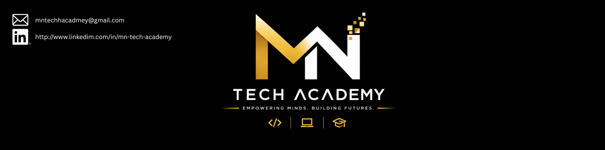
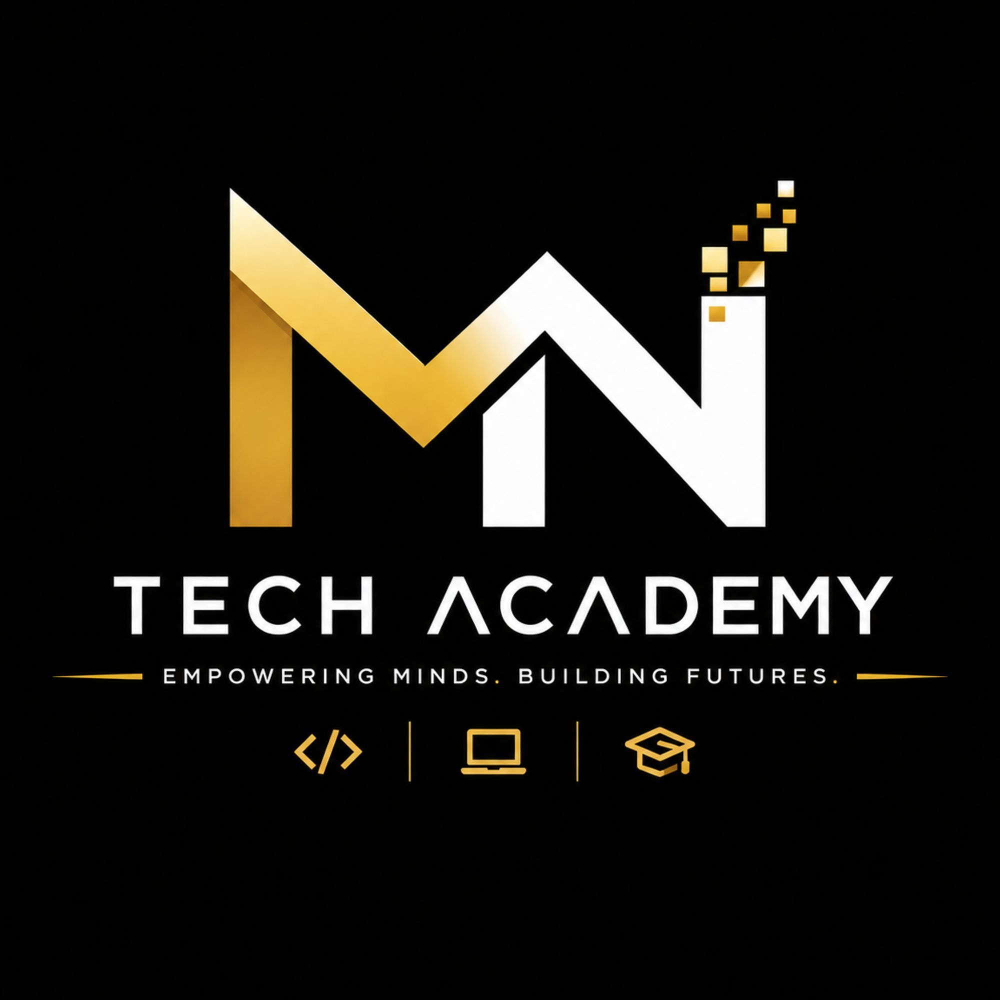

#  Python Development & Automation
### Complete Course Roadmap — MN TECH ACADEMY

 

---

## About This Repository

This repository is the **official, centralized resource hub** for the **Python Development & Automation** course at **[Your Academy Name]**. Every module, lecture, assignment, script, and automation project covered in class will be documented and uploaded here in an organized, module-wise structure — giving students one single place to track progress, revise concepts, and showcase a complete portfolio of real-world automation tools and Python applications.

---

##  Repository Purpose

This repository will include:

- Daily class code & live-session recaps
- Practice exercises and homework
- Module-wise assignments
- Mini scripts & full automation projects
- Notes, references, and cheat sheets
- Git/GitHub practice logs
- Deployment & scheduling guides
- Quiz and hackathon resources

---
---

##  Course Path Overview

| #   | Module                                      | Prerequisites           | Duration   |
| --- | -------------------------------------------- | ------------------------ | ---------- |
| 1   | Python Fundamentals                          | Matric & Computer Familiarity | 1.5 Months |
| 2   | Python Intermediate & OOP                    | Module 1                 | 1.5 Months |
| 3   | File Handling, APIs & Web Scraping           | Module 2                 | 1 Month    |
| 4   | Automation Essentials                        | Module 3                 | 1.5 Months |
| 5   | Databases with Python                        | Module 2                 | 3 Weeks    |
| 6   | Python Web Development (Flask/Django)        | Module 2, 5               | 2 Months   |
| 7   | Data Handling & Analysis                     | Module 2                 | 1 Month    |
| 8   | Version Control, Deployment & Capstone       | All Modules               | 2 Weeks    |

---

##  Module 1: Python Fundamentals

Builds programming logic from zero — students learn how to think like a programmer and write clean, working Python before touching any library.

|                |                                |
| -------------- | ------------------------------ |
| Pre-requisites | Matric & Computer Familiarity  |
| Duration       | 1.5 Months                     |
| Quizzes        | Python Basics · Logic Building |
| Hackathon      | After completion               |

**Topics:**
- Installing Python, VS Code & Virtual Environments
- Variables, Data Types & Type Casting
- Operators & Expressions
- Conditional Statements — if / elif / else
- Loops — for, while, break, continue
- Functions — Parameters, Return Values, Scope
- Lists, Tuples, Sets & Dictionaries
- String Manipulation & Formatting (f-strings)
- Basic Input/Output Handling
- Debugging & Reading Error Tracebacks

**Projects:** Number Guessing Game · Simple Calculator · To-Do List (CLI) · Quiz App

---

##  Module 2: Python Intermediate & OOP

Moves students from writing scripts to writing structured, reusable, professional-grade Python code.

|               |                            |
| ------------- | --------------------------- |
| Pre-requisite | Module 1                    |
| Duration      | 1.5 Months                  |
| Quizzes       | OOP · Data Structures        |
| Hackathon     | After completion            |

**Topics:**
- Object-Oriented Programming — Classes, Objects, Constructors
- Inheritance, Polymorphism, Encapsulation, Abstraction
- Magic/Dunder Methods
- Exception Handling — try/except/finally, Custom Exceptions
- List/Dict/Set Comprehensions
- Iterators & Generators
- Decorators & Lambda Functions
- Modules, Packages & pip
- Working with `datetime`, `os`, `sys`, `random`

**Projects:** Library Management System · Bank Account Simulator · Inventory Tracker

---

##  Module 3: File Handling, APIs & Web Scraping

Students learn to make Python "talk" to the outside world — reading/writing files, calling APIs, and pulling live data from the web.

**Topics:**
- File Handling — Reading/Writing .txt, .csv, .json files
- Working with `requests` — GET/POST, Headers, Query Params
- Consuming Public REST APIs
- Web Scraping — BeautifulSoup & lxml
- Parsing HTML & Extracting Structured Data
- Handling Pagination & Rate Limits
- Storing Scraped Data (CSV/JSON/Database)
- Ethics & Legality of Web Scraping

**Projects:** Weather App (API) · News Aggregator Scraper · Price Tracker Bot

---

##  Module 4: Automation Essentials

The core of the course — students automate real, repetitive tasks across desktop, browser, Excel, and messaging platforms.

|               |                         |
| ------------- | ------------------------ |
| Prerequisites | Module 3                 |
| Duration      | 1.5 Months                |
| Quiz          | Automation Tools          |
| Hackathon     | After completion          |

**Topics:**
- Excel Automation — `openpyxl`, `pandas` (read/write/format spreadsheets)
- Email Automation — `smtplib`, `imaplib`, sending bulk/scheduled emails
- WhatsApp/Telegram Bot Automation
- Desktop GUI Automation — `PyAutoGUI`, `keyboard`, `mouse`
- Browser Automation — `Selenium` (form filling, login automation, scraping behind logins)
- PDF Automation — merging, splitting, extracting data (`PyPDF2`)
- Task Scheduling — `schedule` library, Windows Task Scheduler, Cron Jobs (Linux)
- Building CLI Tools with `argparse`

**Projects:** Auto Excel Report Generator · Automated Email Sender · Login + Data Scraper Bot · Daily Task Scheduler

---

##  Module 5: Databases with Python

Students learn to persist and manage data — the backbone of any real automation or web application.

**Topics:**
- SQLite — Embedded Database Basics, CRUD
- MySQL — Connecting Python to MySQL (`mysql-connector`)
- SQLAlchemy ORM Basics
- Designing Simple Schemas & Relationships
- Connecting Automation Scripts to a Database

**Projects:** Student Record System · Automated Data Logger

---

##  Module 6: Python Web Development (Flask/Django)

Students extend their Python skills into building and serving real web applications and APIs.

|               |                         |
| ------------- | ------------------------ |
| Prerequisites | Module 2, 5               |
| Duration      | 2 Months                  |
| Quiz          | Flask/Django              |
| Hackathon     | After completion          |

**Topics:**
- Flask Basics — Routes, Templates, Forms, Static Files
- Django Basics — Project Structure, Models, Views, Templates (MVT)
- REST API Development (`Flask-RESTful` / Django REST Framework)
- Authentication & Session Handling
- Connecting Web Apps to SQLite/MySQL
- Deploying a Python Web App

**Projects:** Personal Portfolio (Flask) · Task Manager Web App (Django) · REST API Service

---

##  Module 7: Data Handling & Analysis

An optional but powerful module — students use Python's data stack to clean, analyze, and visualize real datasets.

**Topics:**
- NumPy — Arrays, Vectorized Operations
- Pandas — DataFrames, Cleaning, Filtering, Grouping, Merging
- Reading/Writing CSV, Excel & JSON Data
- Data Visualization — `matplotlib`, `seaborn` Basics
- Combining Automation + Analysis (automated reports with charts)

**Projects:** Sales Data Analysis Dashboard · Automated Weekly Report Generator

---

##  Module 8: Version Control, Deployment & Capstone Project

The final module ties every skill together into one polished, deployed, portfolio-ready Python/automation project.

**Topics:**
- Git — init, add, commit, push, branching, merging
- GitHub — Repositories, Pull Requests, Collaboration
- Writing `requirements.txt` & Managing Virtual Environments
- Docker Basics — Containerizing a Python App
- Deployment — Render, Railway, or a VPS
- Final Capstone — End-to-end Automation System or Python Web App

---

##  Daily Workflow

**Instructor Responsibilities**
- Upload daily class code and notes
- Add assignments and review submissions
- Update module content and resources
- Maintain repository structure and consistency

**Student Responsibilities**
- Practice daily and complete assignments on time
- Review and refactor own code
- Build and document automation projects
- Stay consistent through the full course timeline

---

##  Skills You Will Gain

By completing this course, students will be able to:

- Write clean, efficient, production-style Python code
- Apply Object-Oriented Programming to real projects
- Automate repetitive tasks — Excel, email, WhatsApp, desktop, and browser
- Scrape and consume data from APIs and websites
- Connect Python applications to SQL databases
- Build and deploy web applications with Flask or Django
- Analyze and visualize real-world datasets
- Use Git & GitHub professionally in a team workflow
- Containerize and deploy a complete Python project
- Present a portfolio of working automation tools and apps

---

##  Important Notes

- Daily updates will be maintained module-wise throughout the course
- Quizzes are mandatory checkpoints before moving to the next module
- A hackathon follows the completion of every major module
- Revision sessions are scheduled periodically
- All scripts and projects must be pushed to GitHub for evaluation

---

##  Final Message

> "Automation is not about working less — it's about thinking like an engineer and letting code handle the repetition."

This repository is your complete, structured roadmap — from your very first `print("Hello World")` to a deployed, real-world automation system.

---

### [Your Academy Name]
**Building Future Python Developers & Automation Engineers**

⭐ Keep Learning &nbsp;|&nbsp; Keep Automating &nbsp;|&nbsp; Keep Growing ⭐

